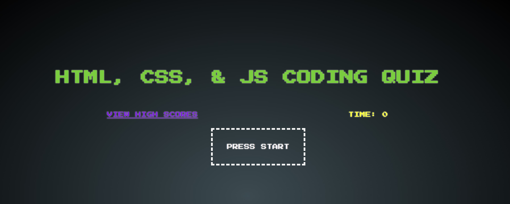

# Web API Challenge: Coding Quiz

## Description

In this project we were to create a timed coding quiz that stores high scores using HTML, CSS, & JavaScript. In this project we used two HTML files, a CSS file, and multiple JS files. 

## Access

<a href="https://ghostofthemill.github.io/shall-we-play/">Click to take quiz!</a>

## Creator

GhostoftheMill
GitHub: https://github.com/GhostoftheMill
