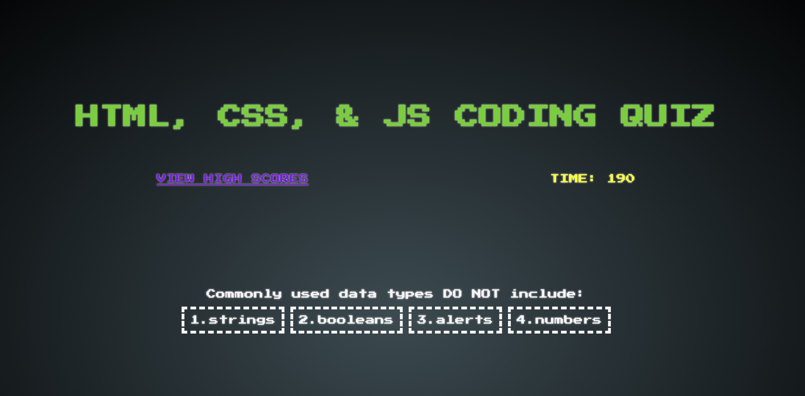
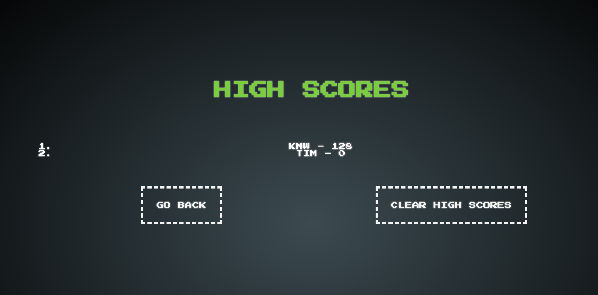

# Web API Challenge: Coding Quiz

## Description

This application is a quiz for HTML, CSS, & JavaScript. It uses the quiz subjects to create the interface. The design evokes memories of old arcade games. After clicking "Press Start" a timer is startede & the user is presented with a series of multiple choice questions. The goal is to progress through the quiz as quickly as possilbe while getting correct answers. Incorrect answers are penalized by deducting time off the timer. When the user has either gone through all the questions or the timer has expired the user can enter their initials into the "High Scores" list, then, try again.

## Access

<a href="https://ghostofthemill.github.io/shall-we-play/">Click to take quiz!</a>

## Creator

GhostoftheMill
 
GitHub: https://github.com/GhostoftheMill

## Screenshots

